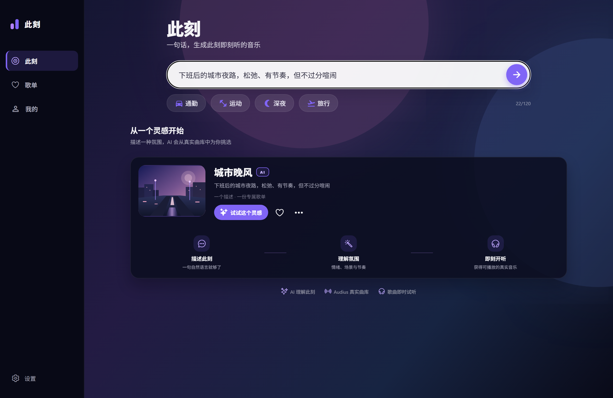
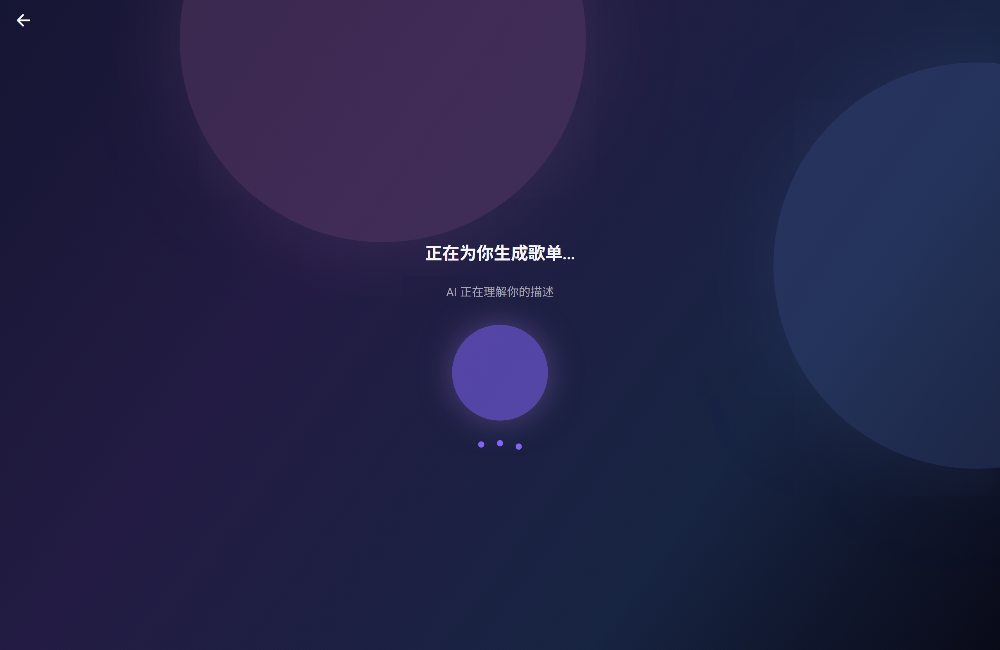
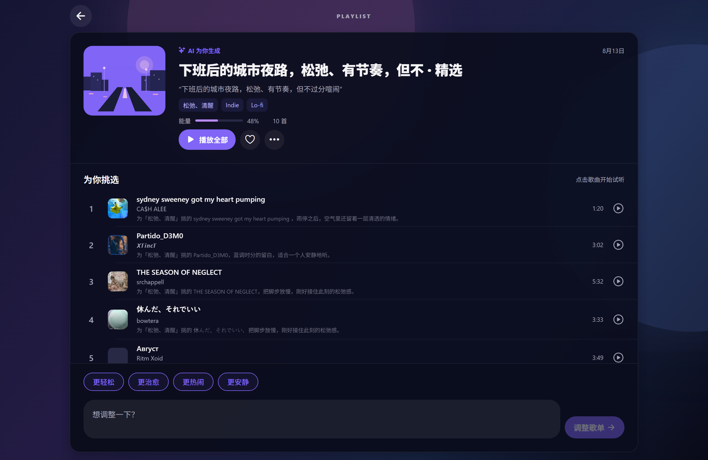
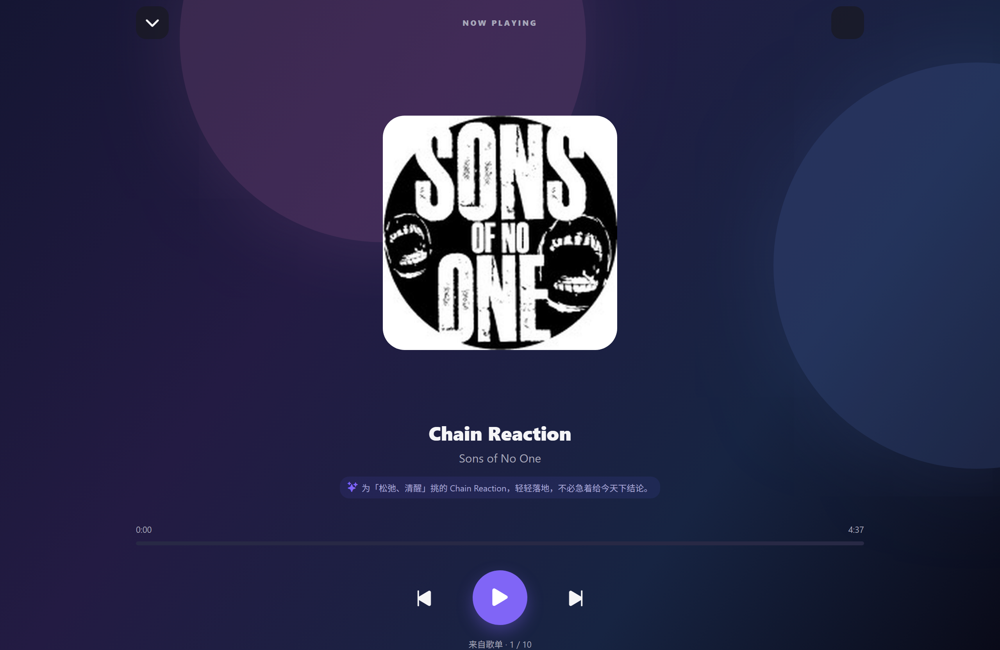

# 🎵 此刻 (cike)

> 一句话，生成此刻想听的音乐。

「此刻」是一个用自然语言生成真实歌单的 AI 音乐应用。你只需输入一句此刻的感受或场景——"加班到深夜的地铁里"、"雨后清晨跑步"、"想哭但哭不出来"——AI 会把它拆解成**情绪 / 场景 / 节奏**三个维度，从开放音乐平台 [Audius](https://audius.co/)（约 200 万首真实独立音乐）召回 **10 首真实可播放的曲目**，并为每一首解释推荐理由。

不是合成音乐，不是占位数据。每一首都是真实独立音乐人的作品，点开即听。

**在线体验（Web 端）**：https://shenyuanyuan77.github.io/cike-demo/

> 在线版为静态演示：音乐播放（Audius 真实曲库）完整可用；AI 逐首推荐理由需要 DeepSeek key，在页面"我的"里填入你自己的 key 即可解锁完整体验。

## ✨ 特性

- 🧠 **DeepSeek 语义拆解** —— 一句话 → 情绪/场景/节奏三维度解析
- 🎧 **Audius 真实曲库召回** —— 10 首真实曲目，非生成、非占位，带四级降级链保证不空手
- 💬 **逐首推荐理由** —— 每首歌都告诉你"为什么是它"
- 🔁 **对话式调整** —— "更轻松一点"、"更热闹一些"，AI 重新召回
- ▶️ **三端可播放** —— iOS / Android / Web 同构，流地址按需懒解析
- 📜 **本地歌单历史** —— 生成记录持久化，随时回看
- 🌙 **暗色主题** —— 玻璃拟态 + 渐变背景，沉浸式视觉

## 📸 界面预览

| 输入心情 | AI 生成中 |
| --- | --- |
|  |  |

| 歌单 + 推荐理由 | 全屏播放器 |
| --- | --- |
|  |  |

## 🏗️ 技术栈

| 层 | 技术 |
| --- | --- |
| 框架 | **Expo SDK 54** · React Native 0.81 · React 19 |
| 路由 | **expo-router 6**（文件路由 + typed routes + React Compiler） |
| LLM | **DeepSeek**（`response_format: json_object`，纯 `fetch` 封装，无 openai SDK） |
| 音乐 | **Audius API**（免认证，独立音乐曲库，整曲免费流式播放） |
| Web 代理 | **Cloudflare Workers + Hono**（解决浏览器 CORS，可选部署） |
| 存储 | `expo-secure-store`（移动端加密）/ `AsyncStorage`（Web） |
| 播放 | `expo-audio`（原生）/ `HTMLAudioElement`（Web） |

## 🚀 快速开始

```bash
# 1. 安装依赖
npm install

# 2. 配置环境变量
cp .env.example .env   # 填入 EXPO_PUBLIC_DEEPSEEK_KEY

# 3. 启动（DeepSeek 本地代理 + Web 服务）
npm run dev
```

默认地址：

- Web 应用：`http://127.0.0.1:8081`
- DeepSeek 代理：`http://127.0.0.1:8787`

> Windows 用户也可直接双击 `启动此刻.bat`；安卓真机预览双击 `安卓预览.bat`（或 `npm run android:preview`，用 Expo Go 扫码）。

## 🔑 环境变量

| 变量 | 说明 |
| --- | --- |
| `EXPO_PUBLIC_DEEPSEEK_KEY` | DeepSeek API key（推荐，[platform.deepseek.com](https://platform.deepseek.com) 申请；不填则进入本地降级模式，仍可召回真实音乐） |
| `EXPO_PUBLIC_DEEPSEEK_PROXY_URL` | Web 端代理地址（可选，部署 edge 代理后填入；不填 Web 端直连，可能受 CORS 限制） |

> Audius 免认证，无需任何凭据。移动端无 CORS 限制，始终直连 DeepSeek。

## 🏛️ 架构

```
一句话 ──→ DeepSeek 拆解意图（情绪/场景/节奏/风格/BPM）
              │
              ├─→ Audius 检索召回 10 首真实曲目（降级链保证不空手）
              │        │
              └─→ DeepSeek 逐首生成推荐理由
                       │
              存入本地历史 → 三端播放（懒解析流地址）
```

完整架构图见 [docs/architecture.drawio](docs/architecture.drawio)，设计文档见 [docs/](docs/)（设计共识 / 架构分层 / 数据契约 / 选型分析）。

## 📁 目录结构

```
src/
├── app/            # expo-router 文件路由
│   └── (tabs)/     # 首页 / 歌单历史 / 我的
├── components/     # 可复用 UI 组件
├── config/         # 运行期配置（端点 / 存储 key）
├── constants/      # 主题与静态 UI 数据
├── hooks/          # 平台 / 主题 hooks
└── lib/            # 业务逻辑（llm / music / playlist / storage）
```

## 📄 License

MIT
